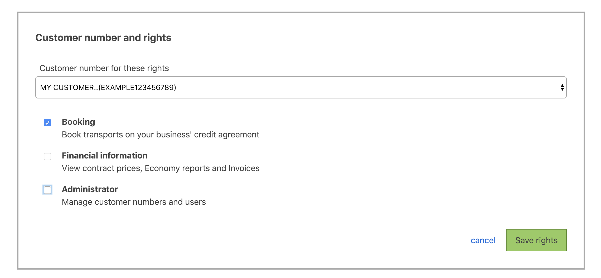

## Authorization

In addition to [authentication](#authentication), you need to be authorized with the _booking_ right in order to perform bookings. This is done in [customer administration in Mybring](https://www.mybring.com/useradmin/external/administration):

To perform a booking, you must specify which customer number to use. For your convenience, there is an [API for getting the customer numbers](#list-customer-numbers) associated with your API user. The Customer Number API also links customer numbers with the services the customer number is valid for.
