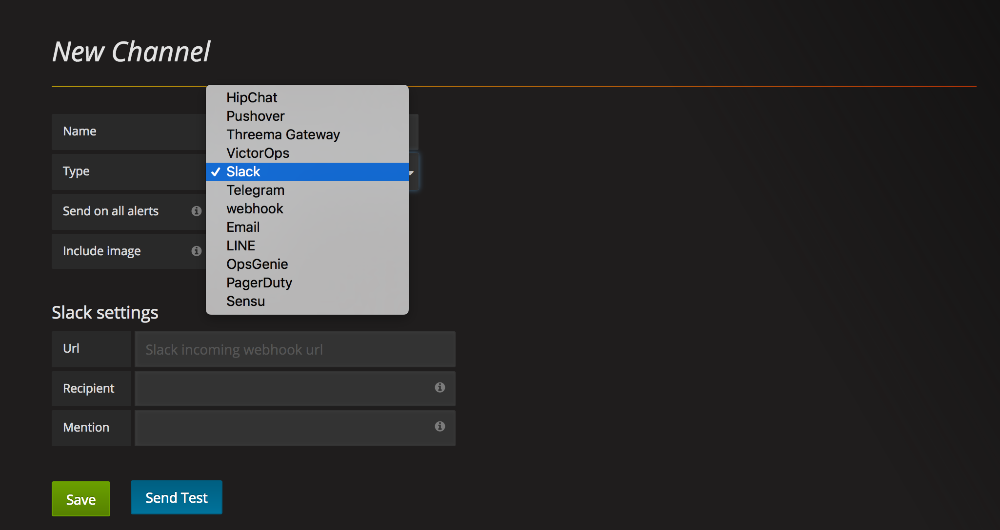
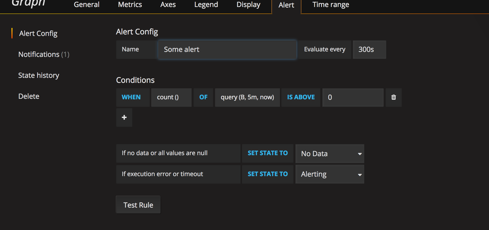
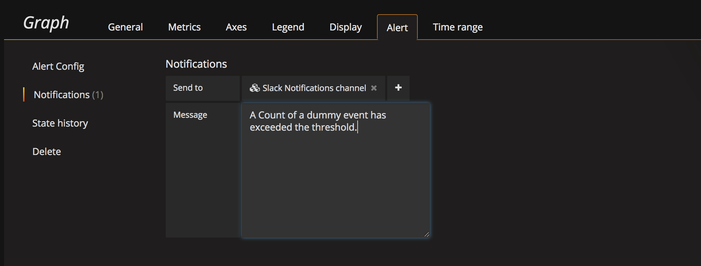

As mentioned in our previous blog, We at bring, use influx and grafana extensively, as one of the monitoring tools to collect statistics and visualize different aspects of applications performance.

We have been quite excited with the latest version of grafana, which now provides alerting engine, which we can set up alert rules on the statistics that we collect all over. 



As shown in above image, grafana provides built in support for configuring different types of notification channels on which you would want to get notified when the alert rule set up on your monitoring is satisfied.

We use slack as the common communication tools and wanted alerts from grafana to reach out on slack, grafana also provides a built in support for integrating these alerts to slack, but there's an issue with proxy support in the latest version of grafana that causes slack integration to not work for us.

So we moved towards another possible simplest solution, grafana also provides ability to get alerts posted on a webhook with a predefined payload which looks something like this.

```json
{
  "title": "My alert",
  "ruleId": 1,
  "ruleName": "Load peaking!",
  "ruleUrl": "http://url.to.grafana/db/dashboard/my_dashboard?panelId=2",
  "state": "alerting",
  "imageUrl": "http://s3.image.url",
  "message": "Load is peaking. Make sure the traffic is real and spin up more webfronts",
  "evalMatches": [
    {
      "metric": "requests",
      "tags": {},
      "value": 122
    }
  ]
}
```

So it was as simple as creating a web hook in one of our custom monitoring application,  parsing above payload and post it to slack, via a home grown library which can post to slack. The advantage of using web hook is that it lets you do any custom processing that you might need to do when an alert rule triggers an alert.

So once configurations for notification channel is done (which in our case is a webhook), we can move towards setting up Rule on our stats that we measure and then grafana takes care of posting to the configured notification channel on that alert rule, when the rule passes.

The way to configure a [rule](http://docs.grafana.org/alerting/rules/) is pretty straightforward and simple. 





We have started using grafana alerts on some of the statistics that we collect, which we used to monitor manually before. It sure is really cool feature to take advantage off. Hope this was helpful and happy reading.


