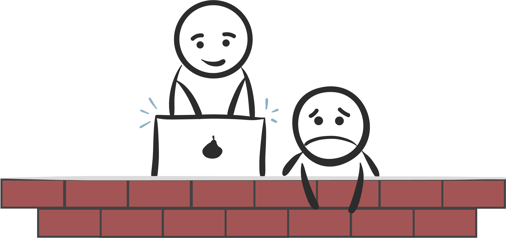
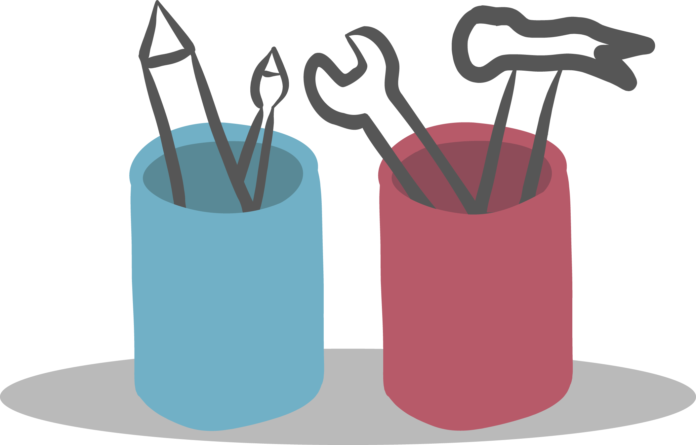

Regardless of how enthusiastic you are laying the first bricks of a project, at some point you’ll realise that the stack of bricks, look suspiciously like a wall, or something different than originally pictured.
The wall can be many things. It can be slow code reviews or a growing list of tasks and features that prevent deployment. It can also be a bug that seem to only appear when the stars are aligned and you press a button too quickly after filling in a form. The common thing is that it makes you feel like you’re either very far from your goal, or that the thing standing between you and the finish line is insanely boring.

So how can one handle this great wall of frustration?

## Coding is not the way

I recently worked on a weird and small application called return.
Frequently used to generate return labels, but a no-mans land for developers as the code had not been cared for in the last 5 years.
I dusted it off, but quickly realised that working with old jsp files, would not keep me at a safe distance from the wall.
So I did what any young developer, who recently learnt a new skill would do:
I rewrote the whole application, and yes I saw the wall.

## The buddy system

Okay, so we’ve established that I lied. You can’t avoid the wall. It's solid, and every project has rough patches. But I have some ideas on how to add padding to the wall. Making it all a little softer and nicer to crash into.

**First advice:** Everyone needs a friend

The key to success for the return project was that I created an alliance with another developer.  Someone who wanted it to be a success, was willing to prioritise and understood the part of the code I didn’t. There’s no better padding than sharing the frustration with someone who is willing, and not afraid to bump into the wall with you.

## Point of good enough

Despite having help, I noticed an unfortunate pattern: For every task I completed, two new ones seemed to pop up. This made me feel incredibly overwhelmed, and the dream of the perfect release seemed far away.

During this stage I was forced to accept that the application would never be fully done. I had to find the point where I was satisfied enough with the UI, and where the application worked well enough to release. Another helpful thing I did was to create a personal Trello board, with all the remaining tasks. Not only did it give me an overview, and allowed me to celebrate every time I moved a card over to the done column. It also made it easier to figure out what had to be done before launch, and what could be fixed later. Turns out a lot can be fixed later.

**Second piece of advice:** Find the point of good enough. It’s okay to have things to do after the application is released.

## Help is out there!

Another benefit to working with others is that they have probably seen the wall before. They know what it feels like, and most likely have a different set of tools! Like something that lets you track all the error messages created by users, which blew my mind. I used to believe that deploying to production meant pressing a button, then waiting for customer service to come back with a list of all the bugs you missed in testing. Turns out there are loads of tools out there, as long as you know what to ask!

**Third piece of advice:** Someone has faced the same issue and frustration before you. If you can’t find the answer online, maybe someone sitting next to you can give you a nudge in the right direction.
(Or maybe you can find some tools in our text about [metrics at mybring](https://developer.bring.com/blog/metrics-at-mybring/))

## Rollback a step forward

The return application is like a satellite, floating around in space far away from all the safe and good architecture, that lets us release to users incrementally.
Instead we had to release to everyone at the same time, which was especially fun considering that we had to roll back twice! The second time was luckily just a confusion, but the first time we discovered that there was an old user flow missing.
We have loads of ways of testing our applications, but none of them beats talking to people.
This was the first time I had to do a rollback. It felt like a failure, but it was also an opportunity to do improvements, without having the stress of a live and broken application.

**Last advice:** Rollback is not a step back, it's just a way of taking the stress away from you, while fixing a problem.
