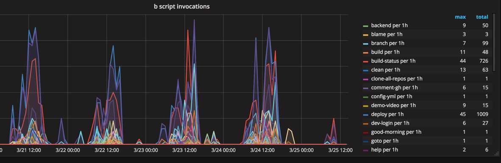

In the web team we have a suite of scripts, that we call the _b-scripts_. This is a collection of scripts that automate some common tasks. Because of our faith in automation, this collection of scripts keeps growing over time and we thought it would be fun to review some of them. We can already reveal that the most difficult part of any of the scripts has been to setup good auto-completion, but it has been well worth the effort. All of our scripts are sub commands to the _b_ command. The _b_ command sets up some environment variables, metrics support, help, and auto-completion for the other commands.

Application specific scripts can be created by putting them in the scripts folder of the application git repository. A lot of applications have their own tooling, but we try to put commonly used functionality in the b-script repository. Currently there are scripts written in python, ruby and bash. In principle, we can use any language, but generally people write scripts in the language they are most comfortable with.

Some of the commonly used scripts are :

- b blame -- Used to find out who has recently deployed an application
- b branch -- Links a git branch with a trello card
- b deploy -- The most used script, we will certainly blog about this script in detail in the future
- b good-morning -- Updates all your local git repositories
- b heapdump -- Generates and downloads a heap dump from a running application
- b help -- Show detailed usage information for another b-script
- b liquibase-migrate -- Apply liquibase database migrations for an application
- b logs -- Shows logs for an application
- b list-pull-requests -- Shows every pull request in a github repository and how long they were active
- b release - Builds a release-version of an application and uploads it to our nexus
- b restart - Restarts an application without user-visible downtime
- b ssh - ssh into app-servers for application in given environment
- b show - Shows any section of an applications deployment configuration
- b build-status - Jenkins uses it to notify on github if a branch has build successfully

Altogether we have over 100 different b-scripts registered across all our repositories. We make sure to instrument them, so we can check how well they are working, and we will definitely write about a few of them in more detail in our future blog posts.
