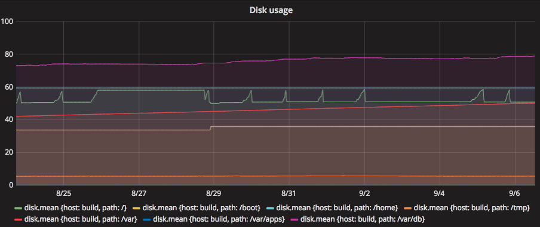
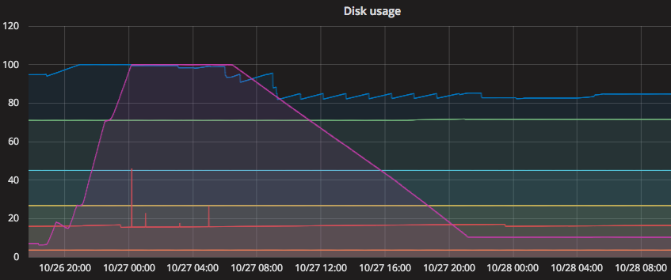
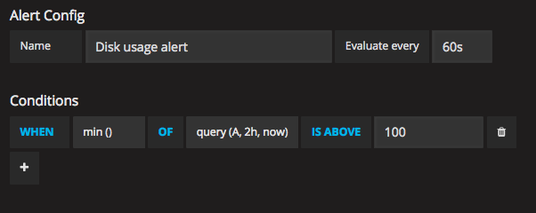
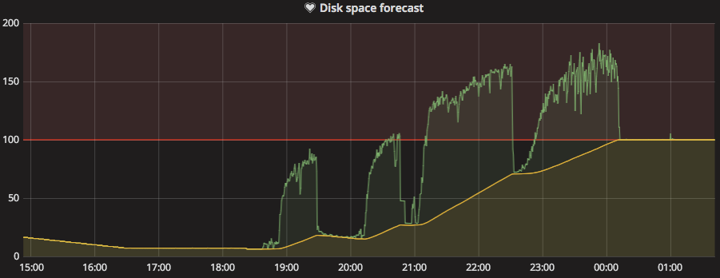

There's a saying that goes &ldquo;an ounce of prevention is worth a pound of cure&rdquo;. As a software developer, I definitely prefer being able to anticipate and prevent problems rather than stressfully fixing broken systems. Frequently when something in a computer goes haywire, it's because it ran out of something important, like database connections, disk space, inodes, file descriptors or kernel magicians. Of these resources, the ones that are easy to monitor usually have some sort of threshold-alerts in order to get ahead of the problems.

The most common one is probably for disk space usage, for example you will get some sort of warning when the disk is 80% full and a critical <a href="https://en.wikipedia.org/wiki/Blinkenlights">blinkenlight</a> if the disk is 90% full. Depending on what that disk is used for, this might be way too late or way too early.

The cases where the X% full thresholds really don't work well for disks are:

- The disk is big, and it fills up only slowly (this is probably the case for a Nexus installation, for example). When you get woken at 3AM to fix the problem, there might still be weeks until anything bad will happen and the situation may very well resolve itself when the system does some pruning in the morning.
- The disk is small, but something went wrong and it is filling up quite quickly. Filling up the last 10% is so fast that by the time you get the alert and find your laptop, it is already too late to prevent an outage.

One approach that might work better for these cases, is to attempt to forecast disk usage. The basic idea is to use time as a threshold, instead of a usage percent. Said differently, &ldquo;alert me at least 24 hours before the disk fills up&rdquo; instead of &ldquo;alert me when the disk is 90% full&rdquo;. Hopefully, the process that is filling up the disk can be fixed before it creates a big problem.

We've previously written about <a href="https://grafana.org">Grafana</a> gaining an alerting engine. Combined with <a href="https://www.influxdata.com/time-series-platform/telegraf/">telegraf</a> and <a href="https://www.influxdata.com/time-series-platform/influxdb/">InfluxDB</a> we have gained the ability to make some pretty clever alerts, and forecasting is one of the things that is much easier now than it would have been otherwise.

With the default setup for the telegraf disk plugin, the following query can be used to get the time series for disk usage into Grafana:

```
SELECT mean("used_percent")
FROM "disk" WHERE $timeFilter
GROUP BY time($__interval), "host", "path" fill(null)
```

This will return a lot of time series, so for the rest of this blog-post, we'll filter the hosts and disks to make it a bit more manageable.

```
SELECT mean("used_percent")
FROM "disk" WHERE "host" = 'build'
AND $timeFilter GROUP BY time($__interval), "host", "path" fill(null)
```

This particular server has a pretty boring disk usage (which is good!), the graph looks like this:




We can see already now that `/var/db` will likely fill up at some point and we'll have to deal with that. But the rate of growth there is pretty low. So even when it eventually hits 90%, we still have probably more than a week to get ahead of the problem.

Below is an example from another machine, where better monitoring might have saved us some from ugly night-time rescue operation:



The goal of our alerting is that ideally, we have hours, not minutes to get ahead of this type of disaster. We can use the InfluxDB query language to find the rate of growth of disks. Namely, the <a href="https://docs.influxdata.com/influxdb/v1.3/query_language/functions/#derivative">derivative</a> seems right up our alley. We can use that to calculate the rate of growth on the disks. Let's try that and see how it looks:

```
SELECT derivative(mean("used_percent"), 1s)
FROM "disk" WHERE "host" = '<redacted>' AND $timeFilter
GROUP BY time($__interval), "host", "path" fill(null)
```


We can see that some time after 21:00, we started filling roughly 1% of the disk every 100 seconds. If we assume that the disk keeps filling at the same rate, we can easily calculate how much disk space we will have consumed in the future. By adding together the rate of growth per 3 hours with the current used capacity, we can get a 3-hour forecast:

```
SELECT mean("used_percent") as actual,
       derivative(mean("used_percent"), 3h)  + mean("used_percent") as forecast
FROM "disk" WHERE "host" = '<redacted>' AND "path" = '/var/db' AND $timeFilter
GROUP BY time($__interval), "host", "path" fill(null)
```


In this graph, I removed all but the interesting disk to make it easier to study. The yellow line is the 3-hour forecast and the green line is the currently used disk. The forecast hits 100% at roughly 20:30 and the disk fills roughly 3 hours and 40 minutes later, at 00:10. Where I'm from, no weather forecast is ever that precise, so that's pretty good.

Many types of disk activities have short spikes of massive throughput. The typical example of that would be a backupjob. They might run for an hour and consume a lot of disk space, before cleaning up some old backups and end up not being even close to filling the disk. So just blindly alerting whenever the forecast hits 100% is not sufficient as it would create a lot of false alerts. In Grafana, we can use the alert engine to set up a rule so that we trigger only when the forecast exceeds 100% for 2 hours, for example.

That might look something like this:



Once you've created the alert, you'll notice that there's a red line in the graph showing the threshold where the alert would trigger, like this:



This is a pretty simple way to set up forecasted alerts. What's really neat about alerting rules in Grafana, is that it is easy to investigate old data and try to figure out when an alert would have triggered. This lets us tune and tweak rules so that we don't end up with trigger-happy alerts. You can read more about the alerting engine at <a href="http://docs.grafana.org/alerting/rules/">docs.grafana.org</a>.
