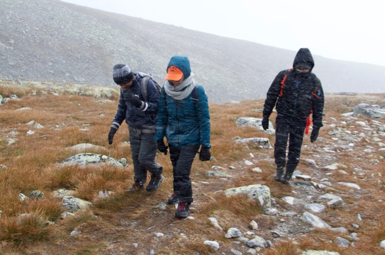
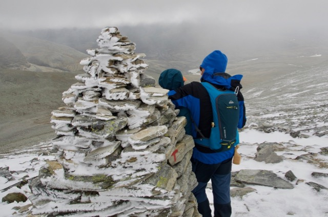
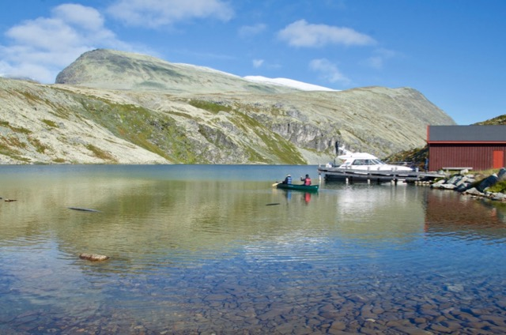
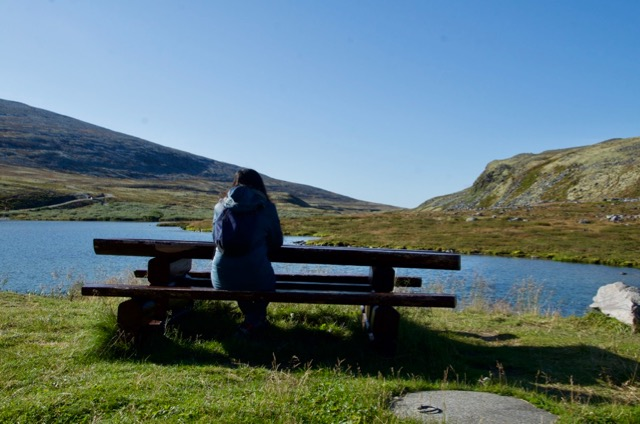
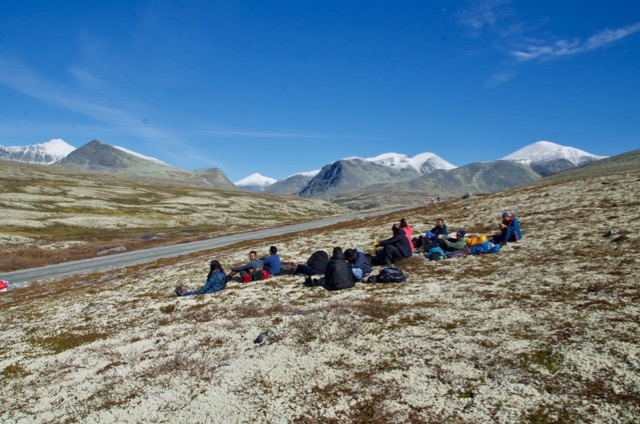

Some years back a few people in the web department headed off for Galdhøpiggen 🎒🥾, not very well equipped. Weather was bad, and they didn't manage to reach the summit. But that hike was the beginning of a tradition with yearly trips to different summits. 🏔

This year 18 people headed off with the train 🚝 to Otta, for a nice weekend at Rondvassbu and where the goal was Veslesmeden. The hike to Veslesmeden was not planned to be that hard, but snow ❄, heavy wind 💨 and a lot of different weather 🌧 made it a tough challenge.

But with helping each other, **all managed to reach the summit**! 💥

## Hiking in bad weather

We started the hike in heavy wind, that just increased. After an hour of walking, rain started and soon it turned into wet snow.

The good part about the snow, is that we could make a snow man ☃ again.

It's getting colder and we try keeping the spirit up in shelter of a big ward. 

Wind is getting even heavier and soon we can't see much either. It's important to stay in groups, and to have both map 🗺 and GPS trackers.

Not far left. We can't see the real summit, but we know it's there.

You're allowed to be ✨ happy and celebrate ✨ after such a hike in bad weather. It was first time winter for some in the group. 🥶

And we all learned the Norwegian term "toppdram"! 🍾

## The awesome next day! 

How could this be?! Saturday gave us the worst weather "ever", but Sunday was perfect! ☀️

We had no rush to catch the train, so this day was used for relaxing and a nice walk back to the taxi that picked us up at Spranget. 

Not often that you can eat your lunch 👝 with such a nice view.

Thank you for the trip! 🌟

