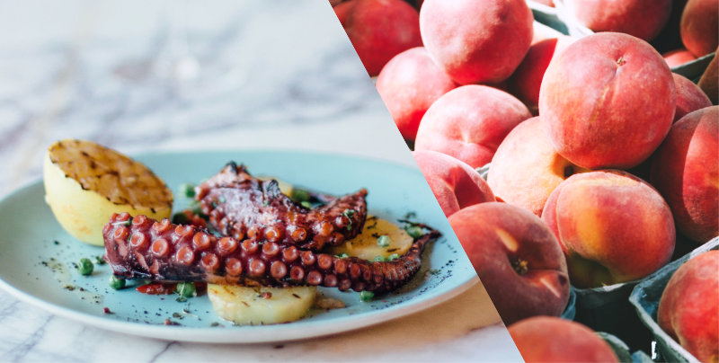

What's the design system documentation without a dedicated page for colours? In our case, it's clearer and with fewer palette detours.
<!--more--> 

## Elements first
We are currently running processes to restructure the [Mybring design system docs](https://www.mybring.com/design-system/) and improving its navigation. My initial approach was to gather everything related in one place. Instead, we are splitting pages and deleting things to make smaller and simpler pieces. 

For the colours, the need for gathering everything came more from what we need when developing the design system than when developing _with_ it. At which point we're looking for elements and components instead. While we put all colours into one CSS file, we also deleted the colour documentation.

By switching from palettes to documenting colours as element properties, we don’t have to add rules to colours. It’s more efficient to say “these are the background types” and “this is the button for so and so” than saying “this is colour _n_, it can be used as such and such, but not as such and such, except when the combination is like so”.

If you need a background, that's what you look for. If you are implementing a button, you don't start off by looking at colours, you look for buttons and then you pick the right one. If you need to build a custom one, you do the same, and it will be based on related elements we already have, and not on a palette.

Colours are not pieces of layout or interface, they are element properties. There are only a few possible colour choices one can make in Mybring. Therefore, our goal is that no colour can be used without making a decision about the element first.

This doesn’t exclude having a dedicated colour page, and we might add it at some point, but as a mere index rather than a starting point.

## “Primary” means _default_
In my early days in printing, some clients wanted posters or flyers with all bold text, they wanted everything to stand out. But when defaulting to bold, there was nothing left to stand out from, _normal_ had been demoted to supporting style.

Colour pages tend to have the same effect. They are listed as one of the first items in a documentation because they are basic properties present in all other elements. But in my experience, such presentation turns them into _base_ elements instead. When making new elements, it makes the palette – and not users and functionality – the starting and reference points.

It also has a tendency to create a hierarchy that is unable to reflect the meaning and importance of the colours. Whatever colours listed first or named things like “primary” or “brand” are seen as more correct and defaults. While the infinitely more useful and important neutral, supporting colours get to be backups.

Rules counter some of that. But they mostly cover edge cases or what already exists. As soon as something different is made, whatever is perceived as primary is present again. 
It becomes a game of colour where the goal is to use as much of the main colours as possible. 

But just like bold text needs contrast to have an effect, so does primary. And no matter how _primary_ a colour is, you can't redefine its meaning, that power lies with the users. Removing the traditional colour documentation makes it easier to base decisions on interface communication needs instead. And defaulting to neutral colours is like using normal text, it doesn't get in the way of how the users _read_ the interface.

## Naming colours
_Primary peach_ and _fried octopus_ might sound cool, but I’ve never been a fan of naming colours in a way that doesn't tell me what the colour is. Using values is oftentimes better. If `hex` is difficult (it is), you can base names off `hsl` or even `rgb` instead. Both require some concentration but are easier to learn.

But in order to create variables, we still need names. And instead of using "primary", "secondary" or "brand" because of reasons stated above, I prefer to include the colour name. “Green” or “bluegreen” and then add the lightness value if there are more than one, like "bluegreen56". Or if the palette is very limited or usage is specific, I use “green-dark”, “green-darker” and “green-hover”. This also makes it easier to talk about colour with people that don’t speak in values. And any `colour/color/clr` prefixes can be skipped.

An exception might be if you are working with themes, but even then there are different ways to avoid or limit abstract naming.

We don't provide variables in the design system at this point, it’s only used internally pre-build. Browser support is the biggest issue, but we also don't need or want to make all colours potentially available to every element.

## Renaming colours
Will we end up with a “green” variable that is actually black sometime in the future?

I don’t think so. How often does a colour change happen? And if it happens, do we want that to be an automated task? Or do we want control, just in case there are any unfortunate combinations? And should colour just be applied to interfaces, or should the interfaces be a defining factor in that change?

As long as we use names specific enough to be searched and replaced in every repo in a controlled manner, we’re at a level of automation vs control I’m comfortable with. 

I think it’s more valuable to make it easy to work with our current setup, than potentially making it easy for those wanting to change the colour three years from now. Since colour is part of the elements, the elements themselves will probably require some changing as well.

----
_Illustration based on photos by [Orlova Maria](https://unsplash.com/photos/sp2lfKOUzAM) and [Nikita Tikhomirov](https://unsplash.com/photos/lQ1nICyM4cA)_
