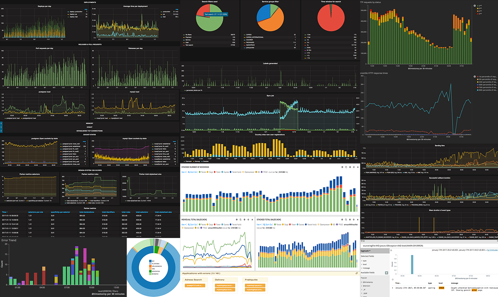
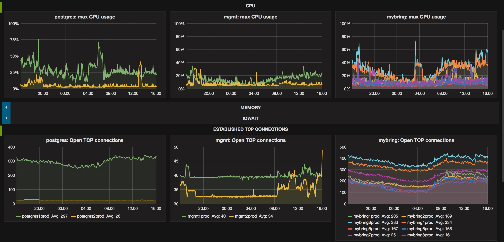

At Mybring, we collect a lot of metrics and we think they are incredibly useful and can be a lot of fun. At the end of the day, it's essential to understand our systems and users. Collecting metrics enables us to take informed decisions - which are based on facts and numbers rather than speculations. We get an overview of the health of our servers, changes in system behaviour are reported over a period of time, which helps us in discovering problems before they happen.

Collecting all the actions done by your systems and developers is really powerful. Imagine you have a dashboard that shows you the page load times for all the pages that recently got slower together with all your deploys. It would be really easy to track down which change that introduced a performance problem. This capability requires you to record both your deploys and your performance data. We don't know exactly which data about our systems that will be crucial to know, so we err on the side of caution and record almost everything we can think of. [This excellent presentation](https://www.youtube.com/watch?v=czes-oa0yik) by Coda Hale goes into many other good examples as to why you should be measuring things.

Other than tracking our application and servers, there are a bunch of other data which are fun to have -- like tracking pull requests and how often we are deploying/releasing to production. It's cool to see the trend of open pull requests, size of pull requests per repository to track down workflow issues. We can also use these numbers to check whether process changes make us more productive and faster.

The picture at the start of this post is a mosaic of graphs from a variety of systems that we have at Mybring. Today as we are mostly writing about metrics, we will focus on InfluxDB, Telegraf and Grafana.

InfluxDB is a time-series database. It is great for storing massive amounts of numerical data that is associated with timestamps. For example we store load averages, cpu utilisation, socket state, memory and many other things. We record this data for 40 servers, every 10 seconds. In one year the InfluxDB data on disk is only 35GB which means we will never have to delete this, which is nice. To read more about how this is possible you should check [this](https://docs.influxdata.com/influxdb/v1.2/concepts/insights_tradeoffs/) out.

We have [telegraf](https://docs.influxdata.com/telegraf/v1.2/) installed on every server, collecting metrics every 10 seconds. To instrument applications, we use a home brewed metrics microlibrary to send data asynchronously to InfluxDB. We do this so that requests to our applications won't fail if we can't write to InfluxDB for some reason. Additionally our scripts that we use to deploy and release applications, also send data to InfluxDB. This lets us find out how fast our deploys are, how often we do rollbacks and a number of other interesting things.

[Grafana](http://grafana.org/) is a tool for visualization of timeseries-data, vis-à-vis server metrics and application metrics. Most of the graphs from above picture are screenshots of grafana. It integrates very nicely with InfluxDB and also supports a number of other backends such as elasticsearch and graphite.

We have created a lot of different dashboards in grafana, the one pictured above is a big picture kind of look on our servers. We use it to investigate performance on the OS level. We have stats about sockets on this dashboard because it is an important resource to track, since it is difficult to debug servers that are out of sockets.

Dashboards are really easy to create with grafana, so we have a lot of them. Some of them are created while debugging production issues. Having all the data in the same view makes it much easier to correlate symptoms with underlying problems. It also supports annotating dashboards with text, which makes these dashboards that are created during outages useful for real time status updates, postmortems and investigating how we could have detected the problem before it occurred.

There are tools available today which makes it really easy to collect and investigate a lot of metric data so there is really no reason not to.
