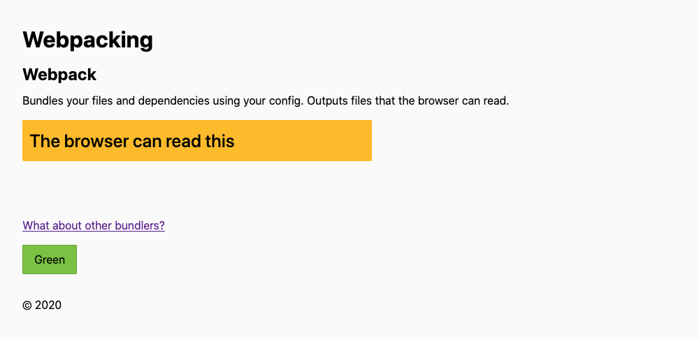

Going from an empty folder to a living React project can feel like a daunting task. As we pointed out in [our precursor](../your-frontend-your-config), if you have been overwhelmed by certain ejected configs or underwhelmed by zero-config tools, it’s time to learn how to set up pragmatic, powerful and customisable configs.

For this, we will be using, but not explaining, Node, npm and the terminal. We will also reference CSS, JS and React, but in no way provide primers.

This guide is split into three, the [first part](#setting-up) is a basic setup for processing JSX files and make a JS bundle. [Part two](#css-processing) adds CSS into the mix. [Part three](#additional-exercises) lists some tips to expand and figure things out on your own. We will provide files and folders with complete configs for part one and two.

## Setting up

Download and unzip the [files for part one](webpack-config-p1.7z). Make a separate folder for your project.

### Package.json

We are going to start off with package.json because it holds most of the project information like name, dependencies, scripts, version and some config.

In our empty project folder, we make a package.json file by running `npm init`. We answer the questions and skip the irrelevant or unknown – all can be changed later as well, or you use the downloaded file as reference.

### Structure

We also need to have something to build and bundle. Copy the downloaded src folder into the same folder as your package.json.

Inside the src folder we have our components, index.html and index.js.

In index.html, we have mounted the app in a div with an id set to `main`. Inside our index.js we pass the element to the `render()` function.

### Dependencies

Get a general idea of what the different dependencies do. We provide some context and recommend reading up on the linked documentation.

After install, you might notice a package-lock.json file and a node_modules folder. The former is the dependency tree. If you use Git, it should always be committed to ensure the same versions being used across potentially different environments. The latter contains the downloaded dependencies and should not be committed.

Copy the two lists of dependencies into package.json and run `npm i` to install them.

<p class="filename">package.json</p>

```json
"devDependencies": {
  "@babel/core": "^7.12.10",
  "@babel/preset-env": "^7.12.11",
  "@babel/preset-react": "^7.12.10",
  "babel-loader": "^8.2.2",
  "html-webpack-plugin": "^4.5.0",
  "webpack": "^5.11.0",
  "webpack-cli": "^4.2.0",
  "webpack-dev-server": "^3.11.0"
},
"dependencies": {
  "react": "^17.0.1",
  "react-dom": "^17.0.1",
  "react-router": "^5.2.0",
  "react-router-dom": "^5.2.0"
}
```

The reason we are doing it this way, is to ensure you have the same dependency versions we have. Normally we use `npm i {list of dependencies}` to install, and add `-D` for developer dependencies. But that would have given us the newest version unless we specified the version number as well. Save any updating for later.

#### Development dependencies

The devDependencies object contains dependencies that are used for development, building and bundling. They handle the code on its way to the bundle, or when running locally, but are not included in the bundle itself.

[Webpack](https://webpack.js.org/) is the Webpack core, which we need in order to get the other Webpack modules and plugins to work. One of the reasons it seems so big is because there are potentially so many plugins and pieces. But the basic structure of Webpack is a core with plugins that you add as you need them, with the config that you need. Defaults are great a lot of the time. This makes the core smaller and our projects smaller. It doesn’t affect the bundle size in itself, but it affects the build time and the dev experience.

[Webpack CLI](https://webpack.js.org/api/cli/) is for using Webpack through the terminal, we use this in our scripts, which we will get back to.

[Webpack Dev Server](https://webpack.js.org/configuration/dev-server/) is for running things locally.

The remaining devDependencies are loaders and plugins that Webpack uses to process our code. We will explain them when we look at the config.

#### Other dependencies

The other type of dependencies are items that need to be part of the bundle. These are typically libraries and frameworks, maybe an icon pack or some external component. It can be helpful, although slightly simplified, to think of them as runtime dependencies.

In this config, we only have [React](https://reactjs.org/) and [React DOM](https://reactjs.org/docs/react-dom.html), which are for React. And [React Router](https://reactrouter.com/) for navigation, it’s not required to work with React, but it’s part of many projects, and also ours.

## Configuring

We need to make configuration files to configure Webpack, its loaders and plugins. This is also an area where you have a lot of potential options. To keep it simple, we use different files for development and production while trying to reuse what we can.

### Developer config

We make a file called webpack.dev.js with some initial config.

<p class="filename">webpack.dev.js</p>

```js
module.exports = {
  target: 'web',

  mode: 'development',

  devtool: 'source-map',

  entry: './src/index.js',

  resolve: {
    extensions: ['.js', '.jsx'],
  },

  module: {
    rules: [
      {
        test: /\.jsx?$/,
        exclude: /node_modules/,
        loader: 'babel-loader',
      },
    ],
  },
}
```

`target` tells Webpack what environment we are running our app in. We normally don’t need to include it, but had to because of a bug in Webpack Dev Server 3 that stops hot reloading from working in some cases. It will be fixed in version 4. Normally `browserslist` is default if such a config is found, if not it defaults to `web`.

`mode` tells Webpack to output dev or production code. This influences things like minifying the code. `devtool` sets the kind of source map we want, useful for debugging in the browser dev tools. `entry` is given a path to the main js file. `resolve` is basically how Webpack behaves when looking for files – our setting allows us to import .js and .jsx files in our components without the file type suffix:

`import ComponentName from './ComponentFile'`

### Module

Inside `module`, we give Webpack some rules for handling various file types.

That is done by setting up a test that takes a regexp for the file type, in our case we want to check for files ending containing `.js` and `.jsx`. The question mark indicates that the previous character is optional.

And we want to exclude the node_modules folder because we have no module inside it we need to transpile. If there were any dependencies that were made using ES6 and newer, and we needed to support older browsers, we would have to include that as well. Only processing the code that needs processing leads to shorter build times – and possibly smaller bundles.

#### Loaders

We also need to help Webpack with file handling. Loaders make Webpack able to load files for processing, like transpiling, extracting and prefixing before bundling. It’s possible to have the loader configs in separate files to provide reusability in our production and dev configs. That way, we avoid duplication and can easily adjust the settings for both when needed. There is no need to import or link to this, as the loaders look up their own config. Take a look at the different loaders’ documentation to figure out what’s possible and recommended.

We have Babel Loader, which allows our other [Babel](https://babeljs.io/) packages to perform actions on relevant code. For this, we will make a new file called babel.config.js and add:

<p class="filename">babel.config.js</p>

```js
module.exports = function (api) {
  api.cache(true)

  return {
    presets: [
      [
        '@babel/preset-env',
        {
          targets: '> .2%, ie 11',
        },
      ],
      '@babel/react',
    ],
  }
}
```

In our Webpack config, Webpack tells Babel Loader “here’s a selection of js and jsx, you know what to do”. Babel knows it should transform our code based on the settings we define, it looks into its own config and finds a couple of presets.

[Babel Preset Env](https://babeljs.io/docs/en/babel-preset-env) makes Babel read settings for your target environment, in our case web browsers. Which means it will also look for a [Browserslist](https://github.com/browserslist/browserslist) config, currently located in the same file informing Babel what it needs to support. And [Babel Preset React](https://babeljs.io/docs/en/babel-preset-react) makes Babel able to read JSX syntax so that Babel can make it into regular JS browsers can read.

### Plugins

In addition to loaders, we have plugins. The separation between the two can be a bit vague, and while plugins can also make files, it can also do other things, like ensuring live reloading of a dev environment. And that’s exactly what we want to do by importing the following two plugins at the top of our file. Including one that comes with Webpack.

<p class="filename">webpack.dev.js</p>

```js
const webpack = require('webpack')
const HtmlWebpackPlugin = require('html-webpack-plugin')
```

And initiating and configuring them by adding the following after the module object.

<p class="filename">webpack.dev.js</p>

```js
plugins: [
  new HtmlWebpackPlugin({
    template: './src/index.html',
  }),
  new webpack.HotModuleReplacementPlugin(),
],
```

[HTML Webpack Plugin](https://webpack.js.org/plugins/html-webpack-plugin/) creates HTML files, usually the index file. It adds the script tag that links to our JS bundle, and has a lot of other possibilities as well. It can be rendered based on a template file, as we have done, or directly from the config. Even though we don’t open the index.html file, it’s what loads when we run the app.

### Dev server

The last point for our dev config is the dev server which we add after the plugins.

<p class="filename">webpack.dev.js</p>

```js
devServer: {
  hot: true,
  port: 3000,
  historyApiFallback: true,
},
```

We use hot reloading, port 3000 and history API fallback. The last two means that any URL on that port redirects to our index.html file, and any 404 response redirects to the index page.

This should give a file similar to our complete dev config you downloaded at the beginning.

### Starting the application

In order to run the project, we go back to package.json and add a script for that as well as one for building files for production. The scripts are really just command line shortcuts. They initiate Webpack and point to what config file it should use. `serve` points to Webpack Dev Server.

<p class="filename">package.json</p>

```json
"scripts": {
  "start": "webpack serve --config webpack.dev.js",
  "build": "webpack --config webpack.prod.js"
},
```

Try running the project locally with `npm start` and open the link to the running app which appears in the terminal, it should be localhost:3000. You should see something like this:


Don’t worry about the missing CSS for now. Make some changes to your component and check if hot reloading works.

If it fails to run, you have to troubleshoot. Check for typos or if you missed something in the config. If not, googling the error message usually provides some answers.

### Production config

For production, we can reuse a lot of what we already have – in fact, we need less config since we are not running production locally, only building it.

<p class="filename">webpack.prod.js</p>

```js
const HtmlWebpackPlugin = require('html-webpack-plugin')

module.exports = {
  mode: 'production',

  entry: './src/index.js',

  resolve: {
    extensions: ['.js', '.jsx'],
  },

  module: {
    rules: [
      {
        test: /\.jsx?$/,
        exclude: /node_modules/,
        loader: 'babel-loader',
      },
    ],
  },
  plugins: [
    new HtmlWebpackPlugin({
      template: './src/index.html',
      hash: true,
    }),
  ],
}
```

Like with dev, we set `mode`, `entry` and `resolve`. We skip `target` because that was only needed for the hot reloading in our case.

We also use HTML Webpack Plugin here to create the actual index.html file. It adds the JS automatically; we don’t have to add script tags. The `hash` option adds a hash to the link that changes when the bundle changes.

Try building the project. We have to upload the output to a server in order to run the application because we use history features that don’t work with file scheme URLs.

If it fails, and it’s not the components, then troubleshoot, fix and try again. Chances are others have had the same problem.

## CSS processing

When we have a working setup and a grasp of how that works, it’s time to start building on top of it. We are going to demonstrate a varied syntax, upping the complexity just a little bit. Perhaps a pattern in the config emerges as we proceed, one that will make it clearer how to extend it even further.

What’s better to add than the _BFF_ of HTML and JS; CSS. Download the [files for part two](webpack-config-p2.7z), and replace the src folder in your test project with the new one.

### CSS in CSS or JS

There are many ways of writing and processing CSS for JS and React. That’s not a discussion that brings any clarity here – we have placed the CSS in CSS files.

For the output, we demonstrate how to bundle CSS in the JS in the dev config, and in a separate CSS file in the production config. These are just examples, and you can do it however you want to.

A separate file makes sense in most cases. But if your entire application exists within the JS and it’s not very big, there might not be much argument to have the CSS elsewhere.

### Scopes and files

We want to handle both global and local scope. Global CSS is regular CSS, it can be used anywhere and everywhere the classes are available because we output unaltered class names.

Local scope is when the class names are processed in order to give them unique names. This is to have them work only where they are specifically referenced and to avoid conflicts with identical class names that are used elsewhere. We use this in component-specific CSS files, for instance where there’s one CSS file for each JSX file.

The variables file has values we will use in both scopes.

Globally, we have base and utility files that use the variables and a common CSS file that imports the other files in listing order. Meaning that only files imported after the variable file can use the variables. It is also imported inside the index.js in order to have Webpack handle it.

Locally, we have one file that will have CSS that is only available to the components that import it. This too uses the variable file and needs to import that because the local scoped file is unrelated to the imports happening in the global, common CSS.

We have added some global classes in our components. In OtherInfo.jsx there is also local scope. A combination which is very common if you, for instance, have a set of general utility classes combined with more specific CSS.

In OtherInfo.jsx we achive this by importing the related CSS file:

`import css from './OtherInfo.css'`

And reference the classes with curly brackets:

<code>className={css.parcelInfo}</code>

And combine it with a global scope class:

<code>className={`${css.parcelInfo} mb5r`}</code>

### Adding dependencies

Just like with JS, we need loaders and processors, all of which are dev dependencies. Update the list of dev dependencies in your package.json and run `npm i` to install them. We will explain the new ones as we proceed with the config.

<p class="filename">package.json</p>

```json
"devDependencies": {
  "@babel/core": "^7.12.3",
  "@babel/preset-env": "^7.12.1",
  "@babel/preset-react": "^7.12.5",
  "autoprefixer": "^10.1.0",
  "babel-loader": "^8.2.1",
  "css-loader": "^5.0.1",
  "cssnano": "^4.1.10",
  "html-webpack-plugin": "^4.5.0",
  "mini-css-extract-plugin": "^1.3.3",
  "postcss": "^8.2.1",
  "postcss-cli": "^8.3.1",
  "postcss-css-variables": "^0.17.0",
  "postcss-import": "^14.0.0",
  "postcss-loader": "^4.1.0",
  "style-loader": "^2.0.0",
  "webpack": "^5.4.0",
  "webpack-cli": "^4.2.0",
  "webpack-dev-server": "^3.11.0"
},
```

### Back to the known

We can continue the config work by moving the Browserslist setting from our Babel config to package.json. This will make it available to everything that needs it, both Babel and the CSS processing we will be setting up. Remove the `targets` object from babel.config.js and add the following to package.json.

<p class="filename">package.json</p>

```json
"browserslist": [
  "> .2%",
  "ie 11"
],
```

### Development config

Returning to webpack.dev.js we add the following inside `rules` after the object handling JSX files with Babel.

<p class="filename">webpack.dev.js</p>

```js
{
  test: /\.css$/,
  use: [
    {
      loader: 'style-loader',
    },
    {
      loader: 'css-loader',
      options: {
        importLoaders: 1,
        modules: {
          mode: (resourcePath) => {
            if (/common.css$/i.test(resourcePath)) {
              return 'global'
            }
            return 'local'
          },
          localIdentName: '[name]__[local]__[hash:base64:4]',
          exportLocalsConvention: 'camelCase',
        },
      },
    },
    {
      loader: 'postcss-loader',
    },
  ],
},
```

This tests to see if we have some CSS files the same way we did with JS and JSX. And because we are going to add more than one loader for the CSS, we create an array called `use`. We could do the same for the JS loader, but this way we don’t write more config than necessary. At the same time, we also want to show some variations on how to write things, which you might run into when reading different documentations.

We also have options, so we expand every loader into an object. We will demonstrate a bit shorter syntax in the prod config later.

#### Style Loader

[Style Loader](https://webpack.js.org/loaders/style-loader/) puts the CSS onto the page by making it a part of the bundled JS file. In the production config, we will set up a separate file output, just to demonstrate the possibilities.

#### CSS Loader

[CSS Loader](https://webpack.js.org/loaders/css-loader/) enables the reading of our CSS code and processes it according to our settings. Since we have both local and global scope, we have added some options to it.

Import Loaders tells how many loaders that precedes the CSS Loader. Inside `modules`, we have `mode`, `localIdentName` and `exportLocalsConvention`. The first holds scope settings and the next two are options for the local scoped CSS.

We need to add a conditional that handle local and global CSS accordingly. We make a function that takes the `resourcePath`, which is the path of the CSS files that are imported in our JS and JSX files. And we check if common.css is part of the `resourcePath`, which means the mode is global and it’s only read without any changes for now.

In any other case, the mode is local. For that CSS, the name of the class is changed to ensure scope. That is something we can control, and we say that it should take the component name, two underscores, class name, two underscores and a 4 character hash.

The last option refers to how we reference the class name in the JSX.

This transforms a class in the following way

Class declaration in CSS file: `parcel-info`

Class referenced in OtherInfo.jsx: `css.parcelInfo`

Class name after processing: `otherInfo__parcelInfo__2i8y`

#### PostCSS

Lastly, we have [PostCSS Loader](https://webpack.js.org/loaders/postcss-loader/) which is for [PostCSS](https://postcss.org/) functionality. It has its own set of plugins configured in a separate file called postcss.config.js, similar to what we did with Babel.

<p class="filename">postcss.config.js</p>

```js
module.exports = {
  plugins: {
    'postcss-import': {},
    'postcss-css-variables': {},
    autoprefixer: {},
    cssnano: {},
  },
}
```

Since we use `import` in our CSS files, we need [a plugin handling import](https://github.com/postcss/postcss-import) and combines all imported files into one.

We also use CSS variables, or custom properties as the technical term is. They are standard CSS, but of the more modern kind. Which means we have to support the users that can’t choose to switch from older browsers. [The plugin](https://github.com/MadLittleMods/postcss-css-variables) replaces the variable pointer with the actual value before bundling. Which means we only use variables as a developer feature in this project. But when we get to a point where this isn’t needed anymore, we can just remove that setting and dependency.

The same goes for [Autoprefixer](https://github.com/postcss/autoprefixer) which prefixes based on the Browserslist config. This is mostly used for certain flexbox properties and some grid support, which we have none of right now, but it’s so widely used that we included it for demo purposes.

And [CSS Nano](https://cssnano.co/) minifies the CSS.

All these can have their own settings, but we run with default most of the time.

Finally, we can run the project again with `npm start` and open localhost:3000. You should see something like this:


Try to change some of the CSS, even variables, to check the hot reloading.

### Production config

For production, we can start off by copying the CSS config into prod. Try to build it, and search the bundled JS file for one of the classes. If you want the CSS in the JS, then you’re done. But we have decided to output the CSS in a separate file.

For that, we need to add [Mini CSS Extract Plugin](https://github.com/webpack-contrib/mini-css-extract-plugin), which we have already installed. We use its loader instead of Style Loader. Since this is a plugin that should output a file, we also need to put it in the plugins part of the config. Lastly, we have the HTML Webpack Plugin that now also puts a link to the the CSS bundle in the `head` element of index.html.

That gives us the following complete production config.

<p class="filename">webpack.prod.js</p>

```js
const MiniCssExtractPlugin = require('mini-css-extract-plugin')
const HtmlWebpackPlugin = require('html-webpack-plugin')

module.exports = {
  mode: 'production',

  entry: './src/index.js',

  resolve: {
    extensions: ['.js', '.jsx'],
  },

  module: {
    rules: [
      {
        test: /\.jsx?$/,
        exclude: /node_modules/,
        loader: 'babel-loader',
      },
      {
        test: /\.css$/,
        use: [
          MiniCssExtractPlugin.loader,
          {
            loader: 'css-loader',
            options: {
              importLoaders: 1,
              modules: {
                mode: (resourcePath) => {
                  if (/common.css$/i.test(resourcePath)) {
                    return 'global'
                  }
                  return 'local'
                },
                localIdentName: '[name]__[local]__[hash:base64:4]',
                exportLocalsConvention: 'camelCase',
              },
            },
          },
          'postcss-loader',
        ],
      },
    ],
  },
  plugins: [
    new MiniCssExtractPlugin(),
    new HtmlWebpackPlugin({
      template: './src/index.html',
      hash: true,
    }),
  ],
}
```

If you compare the dev and prod configs, you will also see that we have shortened the loader array syntax just a little bit.

Run `npm run build` and check that the CSS is in a separate bundled file and not in the JS. Upload the app to a server if you want to check if everything works.

The output name and folder is the same as for the JS, but that can be customised in the plugin’s settings if you need to.

## Additional exercises

Hopefully, you will now have a better grasp of some central concepts and how the different parts work. If you want to build upon that base, we have a few pointers to what you can try and expand on which are relevant for many projects.

### Keeping things up-to-date

In this tutorial we have not instructed you to install the dependencies one by one, but using the ones we have in the package.json file. This is to ensure you have the same version we have tested this on. And it means that there are probably updates to several of the dependencies.

Run `npx npm-check -u`

The command will list all available updates and their kind, major, minor etc. You can select what to upgrade and go step-wise. For majors, it can be a good idea to update one at a time. Build and test it, and read changelogs when you encounter breaking changes.

If Webpack Dev Server has released version 4 by the time you’re reading this, the bug we mentioned requiring us to add the `target: 'web'` setting in our dev config is no longer needed. Try updating to the new version and remove the target option before checking if hot reloading still works.

It’s a constant task to keep dependencies up to date, and how you solve it periodically is up to you. With such a neat config, it’s easier to upgrade that as well, if needed.

### Multiple bundles

It’s possible to have multiple bundles in one config. Start by setting up [multiple entry points](https://webpack.js.org/concepts/entry-points/).

### Output files

We’ve covered input but not [output](https://webpack.js.org/concepts/output/), which works by default but can also be configured to specific folders and bundle names. Especially useful with multiple bundles.

And if you split your bundles or use lazy loading, then you can also set names for those chunks.

### Image files

If you have graphics and image files in your project, [Webpack can also handle that](https://webpack.js.org/guides/asset-management/#loading-images). The concept is the same as with the other filetypes, the config tells what filetypes to look for and what to do with them. Webpack finds the files by reading our already existing links.

## Resources

- [webpack.js.org](https://webpack.js.org/)
- [webpack.js.org/concepts](https://webpack.js.org/concepts/)
- [webpack.js.org/guides](https://webpack.js.org/guides/)
- [Complete setup files part 1](webpack-config-p1.7z)
- [Complete setup files part 2](webpack-config-p2.7z)
