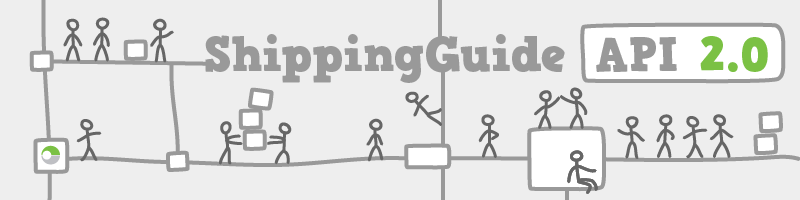
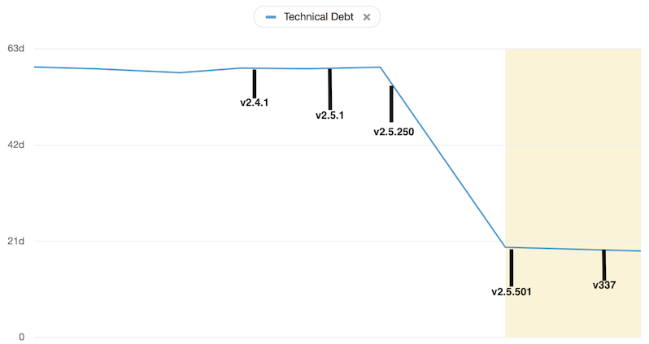
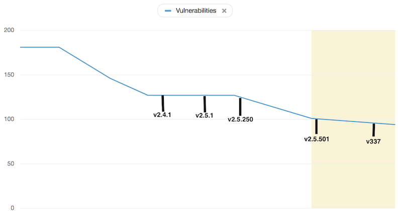

Shipping Guide is one of our oldest applications. As part of a [large internal project](/api/shipping-guide_2/) we knew we were going to do quite a few changes to it. The project was born on the 26th of September 2008. Since then 91 people have worked on the project, contributing 17863 commits to the master branch. Our team did not have much experience with the project and making large changes across the codebase seemed like a daunting task.

The overall architecture was quite solid, but we saw all these bits and bobs attached here and there that didn't quite fit with the underlying architecture. This was probably due to business needs changing over time and these changes not always fitting with the architecture laid out in the beginning of the project. It's quite hard for people working on a project in the beginning to forsee what changes a project will need to support over a timespan of 10 years.

We were able to reduce code in the project by 14% and the size of our deployable by 31.25%. All while implementing the new features, increasing the release cadence and improving the confidence in our test and deploy process. This is how we did it.

## Stabilizing the build

There were some legends around the office about Shipping Guide. One of them was that it would take one workday to release a new version of it. And that it was a long manual process of verification scripts and tests to ensure that everything was still working.

We wanted to work continually on the software and release our changes as often as possible. Preferably outsourcing most of the verification and actual deployment to our automated build agent. This would allow developers to spend most of their time working with the code (which is the fun part anyway).

A couple of the team members sat in a room for a couple of day pair programming on the jenkins build and the surrounding support scripts. They did not end up achieving all the goals they set out to. But they came out of the exercise with a understanding of what the build scripts were trying to do and very valuable insights for all the things to come. Short time after we had automated all the manual verifications in a build job that would run on every new branch and merge to master. The actual automation of the deploy to the production servers was left for later. A couple of months later we felt it was time to automate the deploy as well.

One of the concerns with automating the deploy was that we needed our qa environment to be completely stable, some of the verifications ran by our Jenkins server needed to deploy the release to our QA environment and run verifications against it. We were worried that we would create more overhead for ourselves if every merge to master would spawn a deploy, lock the qa environment and taking up a lot of processing power on our build agent. We could not immediately solve this issue, rewriting the tests to work in a more local manner would take a lot of time. And we wanted to get more involved with the code before we started doing big changes like that.

Luckily another team working at a similarly aged and complex project came up with the idea of a using a release train. Where commits would go into master, and then in a separate scheduled job the releases would run every two hours from master. This turned out to be a success and left the team able to spend most of their time focusing on changing code, rather than babysitting builds and deploys. On feature branches we would run the tests that behaved well in parallel. And then every other hour all verifications would run on master, if all was ok a release would be made. If there was a failure, it would notify us and slack and we all agreed to immediately jump on these issues. Master being releasable had higher priority than anything else.

_release train is informing us that its heading to production with a release containing three commits and bringing attention to the authors of those commits_

## Testing with Wiremock

When we started out there were 2938 tests in the project. Some of these were integration tests that contacted live servers in our QA environments. This caused the tests to sometimes fail due to factors outside of our control. To be able to rapidly build and deploy  we had to find a way to get rid of this dependence on external systems. There were previous attempts to do this via libraries like mockito but we felt it did not provide quite the functionality we needed. 

[Wiremock](http://wiremock.org/) is a tool that allows you to run it in proxy mode for recording communications between endpoint and then storing these recordings to have Wiremock act as a mock server. So rather than writing a bunch of Mockito code, we could point our integrations to the Wiremock server containing our recordings. This way we didn't have to write mock variants of our services and we could exercise the code up until the point where it left the server. This stabilized the build quite a lot and gave the developers more confidence in the tests. With the help of Wiremock we can now build and test the project without internet access, something which seemed far-fetched at the beginning of this journey.

## Getting rid of dependencies

Over time in a Maven project, as the dependencies change and new libraries are added it is not always easy to remember to delete the dependencies no longer in use. Additionally Maven by default allows transitive dependencies. This can lead to issues where you don't really need a particular dependency, but the build still relies on some of the transitive dependencies that it pulls in. 

To fix this we utilized [maven-dependency-plugin](https://maven.apache.org/plugins/maven-dependency-plugin/) and explicitly failing our builds if there are unused dependencies or used but undeclared dependencies. This plugin does give a couple of false positives but by adding some exclusions to the configuration it can still be a good tool for whipping a build back into shape. We gradually introduced this plugin across all the modules and over time we saw that as we were refactoring code more and dependencies could be deleted. It feels pretty good to refactor a bunch of code and then having the maven-dependency-plugin tell you what dependencies can now be deleted. Overall the tool could be better, but we found it far surpassing not having anything at all. One of the things we found to reduce the number of false positives was porting our xml based spring configuration to be plain java objects. It also made dealing with the configuration a bit easier as most of us found Java to be a little more friendly to humans than xml.

To this day the size of the deployable has been reduced by 25MB.

## Decoupling Web & API

Shipping Guide is primarily an API, but in the beginning it also served a frontend. Some of the frontend features had been subsumed by other applications in our ecosystem, some were no longer in use and rest were stuff we wanted to keep around in a more up to date and modern fashion. 

We decided move all frontend related code to a different deployable which would get its data from Shipping Guide the same way our users does. Keeping the frontend and backend contexts separate like this enabled us to work faster on each deployable and gave us more confidence in cleaning up the frontend code without messing up stuff for the backend. 

## Summary

All in all we are quite happy about where Shipping Guide is now. There will always been things to improve in projects like this, but our focus on cleaning up the things that would let us move faster with more confidence have made those future cleanups seem less like extensive and more like a walk around the woods.

Below are some interesting stats across some of the many releases of Shipping Guide the past year.

### Odeurs

Cause who likes to work in a smelly environment?<a href="#fn1" id="ref1" role="doc-noteref">1</a>

### Cyclomatic & Cognitive complexity

Cause who likes to work on code they cannot comprehend?<a href="#fn2" id="ref2" role="doc-noteref">2</a>

### Lines of code

Cause less is more!

### Technical debt

Cause the power of compounding is not always beneficial<a href="#fn3" id="ref3" role="doc-noteref">3</a>

### Vulnerabilities

Cause security!

<ol class="footnotes" role="doc-endnotes">
  <li id="fn1" role="doc-endnote">
    <a href="https://en.wikipedia.org/wiki/Code_smell">https://en.wikipedia.org/wiki/Code_smell</a> 
    <a class="footnote-jump btn-link di" href="#ref1" title="Jump back to footnote 1 in the text">&#8617;</a>
  </li>
  <li id="fn2" role="doc-endnote">
    <a href="https://en.wikipedia.org/wiki/Cyclomatic_complexity">https://en.wikipedia.org/wiki/Cyclomatic_complexity</a> 
    <a class="footnote-jump btn-link di" href="#ref2" title="Jump back to footnote 2 in the text">&#8617;</a>
  </li>
  <li id="fn3" role="doc-endnote">
    <a href="https://en.wikipedia.org/wiki/Technical_debt">https://en.wikipedia.org/wiki/Technical_debt</a>
    <a class="footnote-jump btn-link di" href="#ref3" title="Jump back to footnote 3 in the text">&#8617;</a>
  </li>
</ol>
