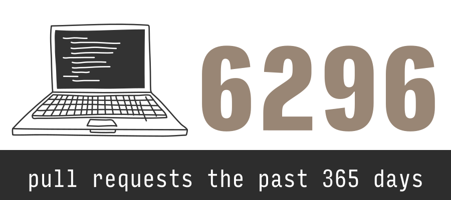
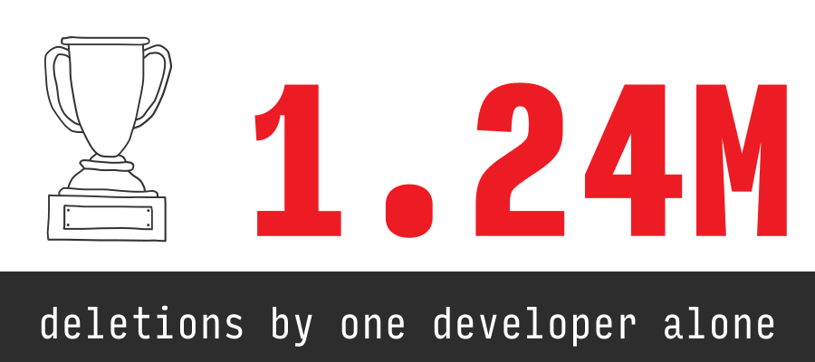
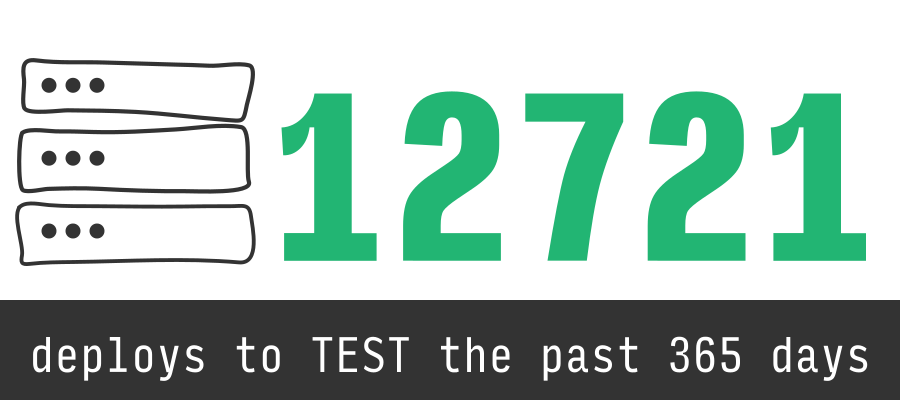
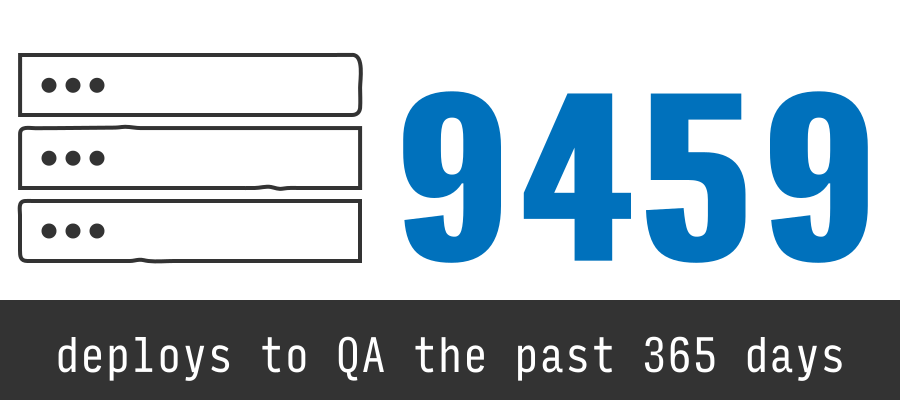
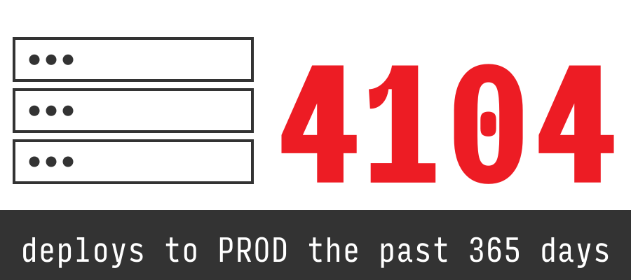
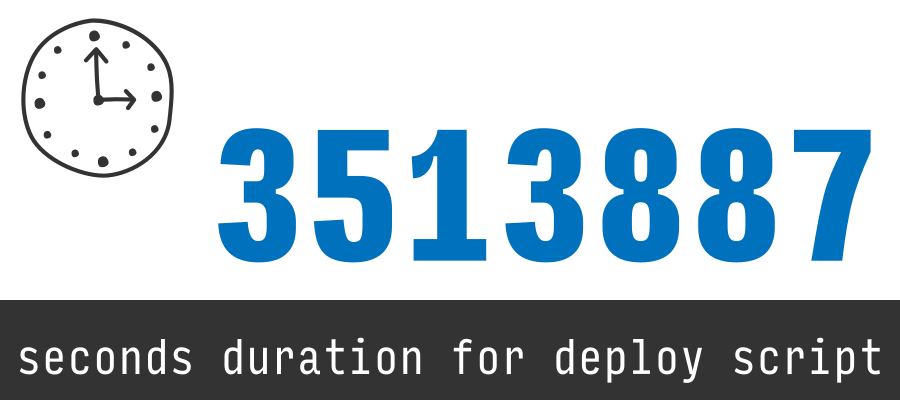
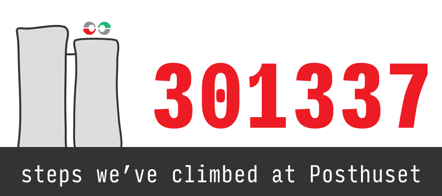
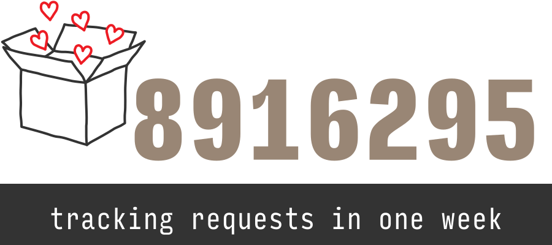

Sometimes it's fun to take a break and look back at what's happened in the past and do a little reflection. Or maybe we just think numbers are fun -- there's probably a reason why we like computers! So today we have sat down and looked at the recent past to try to find some interesting numbers. Everyone knows there's strength in numbers, so here we go!

What can 42 developers do in 365 days!
---

We have produced a total of 6296 pull requests on github -- that's change proposals to code and documentation.

We seem to write about 2.8 code review comments per pull request and there was one pull request with a whooping 202 comments on it! Most pull requests have much fewer, because we prefer to make small pull requests, so there's usually not that much to discuss.

Also you know what is more amazing than writing a brand new super-useful, super important piece of code? Deleting it! ahh, Joys of Deleting.

One heroic developer deleted 1.24M lines alone. That's probably saving us megabytes of disk space. Megabytes!

We produced 4469 releases of our applications. That's more than 20 releases per working day!

By the looks of it, we're deploying most of the time. The last year, we have logged 26 284 deployments in total!

12 721 to our happy test servers who enjoy life on the bleeding edge,

9 459 times to our more stable QA servers...

... 4 104 to our lovely production servers.

In order to get all of that work done, our deploy script has been running for more than 3 513 887 seconds, or just a little bit less than 6 weeks.

It's a very diligent script! 11 441 of the deploys were done by our build server, which is doing a lot of our work for us. We're increasingly automating our way out of having to do work ourselves so we have more time for blogging. We're also branching out to deploying from the train because we see at least 2 deploys from NSB_INTERAKTIV!

We've climbed exactly<a href="#fn1" id="ref1" role="doc-noteref">1</a> 301337 steps the last 365 days! That probably means we've climbed Everest, right?

What do our users do?
---

This would really take way too much investigation to answer thoroughly, but one thing we know they really like doing is to track shipments!

We took a sample of these tracking requests done over a period of one week -- here's a few fun numbers we found:

- On average, each tracking request is sent 10.5 times to us. Clearly an indication that shipments get there faster if they are tracked a lot!
- Some shipments are tracked a lot of times! The most popular one was tracked 13 791 times, the runner up has 10 041 tracking requests. Let's just hope that at least some of those requests were done by computer programs, not people!
- Only 312 231 tracking requests happened only once -- that's only 3.5%.
- 177 856 tracking requests were seen over 10 times that's a bit less than 2%.

The business applications that most of us work on have users with older browsers than the general public, so we have to build UIs that take this into account. Internet Explorer 11 is now over 4 years old, so this provides… interesting challenges.

<ol class="footnotes" role="doc-endnotes">
  <li id="fn1" role="doc-endnote">
    Strictly speaking, at least, not exactly. Who's counting? There at least 200 working days in the year and at least 5 people take the stairs after lunch every day. On average we work on at least the 15th floor and there are at least 20 steps to go up one floor. So that's at least 300 000 steps! 
    <a class="footnote-jump btn-link di" href="#ref1" title="Jump back to footnote 1 in the text">&#8617;</a>
  </li>
</ol>

