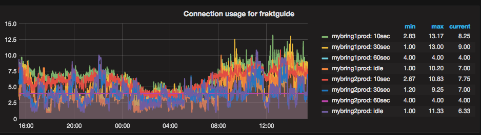

We use client-side connection pools in our applications, in order to ensure that incoming requests can quickly get a database connection. This way, users don't have to wait for the application to do a potentially expensive handshake with the database during their request. Most of our applications are Java applications, and we use a mix of [HikariCP](https://github.com/brettwooldridge/HikariCP "HikariCP GitHub") and [c3p0](https://github.com/swaldman/c3p0) pools. We're probably moving in the direction of using HikariCP everywhere, as it seems easier for us to tune.

When we were initially setting up our postgres cluster, we did some research on how to tune it, and one of the parameters we found hard to set was `max_connections`, which determines how many connections that clients can make to the database server. Most of the documentation and blog posts we found stressed the importance of not setting it too high, but didn't specify exactly what that meant. The [postgres wiki](https://wiki.postgresql.org/wiki/Tuning_Your_PostgreSQL_Server) states that it should be at most a few hundred on good hardware. So we set ours to 200 for the initial setup.

We have 11 applications that were going to end up using postgres and we hadn't done any tuning to their individual connection pools. We decided that we would accept to just deal with the connection pool size later on, and proceeded to set up our database with a conservative `max_connections`.

There are good resources that document why you shouldn't use too many connections against your database. Higher amounts of connections might mean that each request gets database access faster, but it does not necessarily mean that their results are ready sooner. A contrived example of how this works:

Imagine you're in a line in a fast-food joint and you order a burger. There's only a single employee in this fast-food joint and they need 2 minutes to prepare a single burger. There are 10 people in the line and they all want burgers. The math here is easy, it'll take 20 minutes to serve everyone. Making this single employee work on many meals in parallell won't change the total time they need to finish cooking the meals. If the employee spends 1 minute on each meal, all the meals are 50% done and 10 minutes have passed. Nobody has gotten to eat yet. If that employee then finishes up all the burgers at the same time, everyone gets their meal after 20 minutes and can start eating. But if that employee instead finishes one meal at a time, they can start serving people after only 2 minutes. So the best-case and average wait-time improves a lot, and the time and resources consumed is still the same (20 minutes, 10 burgers).

In a database system, your resource constraints are going to be the CPU, memory or disk and those resources cannot be scaled to infinite degrees of parallellism. So you can't just throw an infinite number of connections at the problem, because at some point you start the underlying system will start queueing requests to the hardware. The disk can't respond to 10000 disk reads at the same time, there's going to be some sort of queueing in postgres, the OS, and maybe the hardware. In many cases, having very few connections might improve latency for incoming queries. There's an interesting post from HikariCP on this topic called [Pool Sizing](https://github.com/brettwooldridge/HikariCP/wiki/About-Pool-Sizing "HikariCP About Pool Sizing").

During fall 2016, when we were done migrating most of our applications to use postgres, we started running into problems with our `max_connections` setting. At the time, we tried to reduce our connection pool sizes in the the applications, but it proved to be really hard to figure out exactly how many connections each application would need. We still haven't really figured out a great way of tuning this particular parameter and have instead increased our `max_connections`. But we've done some work on improving this situation and started tracking how many connections that are in use in each database on the database side.

We do this by running queries against the [pg_stat_activity](https://www.postgresql.org/docs/9.5/static/monitoring-stats.html#PG-STAT-ACTIVITY-VIEW) view, our query to log this data looks something like this:

```sql
with states as
    (select datname, client_addr, case
        when now() - state_change < interval '10 seconds' then '10sec'
        when now() - state_change < interval '30 seconds' then '30sec'
        when now() - state_change < interval '60 seconds' then '60sec'
        else 'idle' end
    as stat from pg_stat_activity)
select datname, client_addr, stat, count(*)
from states group by datname, client_addr, stat;
```

The idea being that if an application has lots of connections that have been idle for more than 60 seconds, it's probably safe to reduce its connection pool size. We collect this data using [telegraf](https://github.com/influxdata/telegraf) and visualize it into a [grafana](https://github.com/grafana/grafana) dashboard, an example graph is shown below:



We haven't done much with this data yet, but we are seeing significant numbers of idle connections, so we know that we can improve matters.

A really easy way to end up with large connection pools is to give in to knee-jerk reactions to increase pool-size whenever an application can not obtain a connection from the connection pool. That's the wrong reaction in many cases. Think of it like this: If your application has 10 connections and all your transactions run in 5 milliseconds, that means that each connection can execute 200 transactions per second, giving you a total capacity of 2000 transactions per second. If you run multiple instances of your application, you can multiply that number further. We run each application in at least 2 instances, so in this example, we'd be able to execute 4000 transactions per second. That's 345,600,000 transactions per 24 hours. None of our databases require a throughput this high.

If your transactions take 50 milliseconds, that number goes down by a factor of 10. So the first thing we should be checking when we're running out of connections, is if we have an opportunity for a factor of 10 performance optimization of transactions. Many queries can be made orders of magnitude faster by adding missing indexes, restructuring the queries or other trivial fixes. Some queries can not easily be made to be very fast, and in those cases it might make sense to increase the connection pool size. Some queries can also be slow for non-obvious reasons. We have examples of queries that are super-fast most of the time, but early in the morning, they are slow. This is probably because the data is not in any file-system cache because it hasn't been accessed all night.

What tends to happen when users encounter slow pages is that they will try to refresh, issuing another query and occupying another slot in the connection pool. When a query takes over a minute to execute, 10 users are easily capable of exhausting a modest connection pool between them. The best fix in this case, is to make queries faster. This has the added benefit of making users happier too.

We're trying to get into the mindset where we think of increasing connection pool sizes as a temporary workaround or a last resort and instead get better at writing efficient queries.
