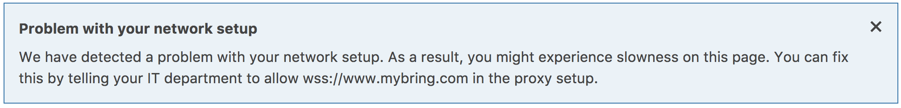

The following writeup is the story of a fairly exhausting search for a bug in Mybring, that we encountered because we thought that the now 7 year old websocket standard would be safe to use. It's a fairly comprehensive writeup that covers a few hectic days in January where we got familiar with the RFC, how the http-websocket upgrade handshake works, driving to a customer in order to debug the problem on-site with wireshark and lots of trial and error. The short summary is that if you have customers with "very secure" corporate networks, you need to be very careful about relying on websockets to work. The long story follows here -- if you prefer the condensed version, there's a list of learning points at the very end of the text.

Background
---

For a while now, we have been reworking what we call the promotions page in Mybring. This page is the entry-point to booking shipments in Mybring and is one of the more important pages we have. On this page, users enter a sender and a recipient and they'll be told of which options they have for sending something between them. The page will tell them an approximate price and lead time for delivery for each service eligible for the transport. When clicking on a product on this page, they're taken to a different part of Mybring where they can fill in all the specifics of the shipment and order it.

There's a lot of complicated business rules that together decide which services, prices and lead times we can show. For example, you might get a completely different selection of services for shipments to Svalbard and shipments to St. Petersburg. The lead time for sending something from Oslo to Oslo is different than when sending something from Kirkenes to Oslo. We use the [Shipping Guide API](https://developer.bring.com/api/shipping-guide/) to retrieve this information, but the shipping guide itself is not the master of all of this information. For certain services, it needs to ask other systems, which again, may need to ask other systems. For this reason, it takes longer to retrieve prices and lead times for some services than for others, even though it is very fast for the most common cases.

In order to reduce the time needed to display something for the user, we want to trigger many searches in parallel and reveal data to the user as soon as we have it. To us, this sounded like a good case for using websockets for continuous communication with the backend (which knows what to ask the shipping guide for) and the frontend. So we checked if [we can use websockets](https://caniuse.com/#search=websockets) and it turns out that almost everything under the sun supports it by now. Which is a good thing, since the standard is roughly 7 years old now. It's already been in school for a year or two!

The websocket protocol provides full-duplex communication over TCP. It's much slimmer than HTTP and provides a persistent connection. Being full-duplex means that it doesn't need to follow the request-response pattern, the participants can send messages in any order. In order to set up a websocket, a client makes a special kind of HTTP-request, looking a bit like this:

```
GET /ws-endpoint?you_can_use=query-params HTTP/1.1
Host: example.com
Connection: Upgrade
Upgrade: websocket
Sec-Websocket-Version: 13
Sec-Websocket-Key: 7p85V3oVH+k1VZGQNd6J/w==
Cookie: maybesomecookiehere
Origin: http://example.com
```

To which the server is expected to reply something like this:

```
HTTP/1.1 101 Switching Protocols
Upgrade: Websocket
Connection: Upgrade
Sec-Websocket-Accept: lMKn+uhhSqLveA+g9MuhgeA7I3A=
```

At this point, both sides of the connection should keep it open and start speaking the websocket protocol instead of HTTP.

We implemented the solution using websockets and it worked great. The parameters for the search were passed as query parameters to the backend on a `wss://`-endpoint and the backend would produce one websocket message for every product, as soon as they became available. When the last product was sent, both ends of the connection would close the websocket and everyone would be happy. Testing showed this to work well in all major browsers. At this point, we started discovering lots of complex business rules that we had to go about fixing and suddenly one day, we were ready for launch.

On launch-day, we started getting error reports from customer service. Some of those were usability bugs that we had missed, some were business rules we had gotten wrong. We were able to quickly fix most of these problems. However there were some disturbing reports of the new promotions page just never returning any results for some users. After a couple of days, it became quite clear that it was something we _really_ had to look into. The reports were too many for them to be some sort of coincidence or temporary network problem and we were getting reports of some users phoning in multiple times. We verified again that the websocket solution acually worked in all major browsers, on all major operating systems. Then, a helpful person from customer service suggested that it may have something to do with security, since all the customers affected by this problem seemed to be the kind of customer who take extra precautions.

Websockets security
---

We started reading in more detail about websockets and identified one thing right away that was a potential problem. Notably, websockets do not respect the same-origin policy. That's a security problem right there -- this enables someone else to make a webpage that opens a websocket to your page. If any of your users visit this page, their browser will open the websocket channel, sending cookies etc to it. If the user is logged in, that enables this page to access their data. The fix is simply to verify the `Origin:`-header that the browser sends with the websocket handshake. We deployed a fix for this security hole a couple of hours after it was identified, but that was clearly not the problem that was affecting our users from secure corporate networks. Other than that, the usual suspect was IE11 on Windows 7, so we started digging into that. After a little while, it became clear that we could reproduce the issue by setting Security Settings for Mybring to High. But that also broke other functionality that we knew to be working for these users (logging in to Mybring, for example), so that was clearly not the culprit. And the same day, we got reports that other browsers were affected too.

At this point, we felt like we really needed more information than what we had available at the time and started looking for ways to get some error messages from the client. Eventually this wound up with us setting up [Raven.js](https://github.com/getsentry/raven-js) to get frontend error-repporting into [sentry.io](https://sentry.io). This helped us identify some more bugs that we had initially missed, and has been a great tool overall. And we were finally able to get some details about what was going on with the websockets. What we found was that lots and lots of users were getting their websockets closed with status code 1005 and 1006. As per the [RFC](https://tools.ietf.org/html/rfc6455#section-7.4.1), that means either that the clients connection closed without a status code, or without a close control frame at all. We figured we could improve something by handling these cases, however it turned out that a lot of clients got these status codes even when everything had worked OK, so whatever was causing these weird status codes to appear wasn't necessarily causing the websocket connection to fail.

Finding some actual errors
---

Google didn't help much -- we were finding lots of reports that proxies can break websocket connections, but it was also written that this shouldn't be a problem on secure websocket connections (`wss://`, which we were using). A couple of hours after we activated reporting to sentry.io, we were able to get in touch with an affected user on the phone. He was super-helpful -- at first we attempted to set screen-sharing over [appear.in](https://appear.in), but we were unable to do that. The stream and chat both simply never loaded on the users' machine. This seemed to confirm the theory that there was something super-secure with that user's setup. After talking for a while, we were able to uncover 3 errors in his IE11 developer console that seemed worth looking into. They were:

- `SCRIPT12152: Websocket Error: Network Error 12152, The server returned an invalid or unrecognized response`
- `SEC7122: Credentials flag was set to true, but Access-Control-Allow-Credentials was not present, or was not set to "true".`
- `SCRIPT7002: XmlHttpRequest: Network Error 0x80070005, Access is denied.`

We also confirmed that his Security Zone Settings for Internet were set to default. There were no odd settings for cookie control and [the websocket object was not turned off](https://www.windows-security.org/7015789185d14cf73d8c24fe01231528/turn-off-the-websocket-object). But we were unable to use `regedit` or `gpedit` on his machine to do a broader check of security settings, so it was clear we could have missed something.

Our backend is written using [ratpack](https://github.com/ratpack/ratpack) and we discovered a limitation in `WebsocketEngine.java` that didn't allow us to set `Access-Control-Allow-Credentials` on our response to the `Connection: upgrade`-request. In desperation, we worked around that by modifying it locally to set that header, but it did not fix the problem.

None of the other errors gave any definitive answer about what was going on, even though there are lots and lots of issue-tracker hits and stackoverflow posts that match them. We were not able to find out which network traffic that triggered the errors and were still unable to reproduce them no matter how badly we mistreated our computers. It seemed clear that we would need to reach out to a user experiencing the problem, again. This time we prepared better and made a list of questions we wanted the answer to, and sent out a mail containing some things that were difficult to talk to user through over the phone.

- Which exact operating system and browsers were affected?
- Is it only the websocket traffic that breaks?
- Do websockets work with other webpages? We used [websocket.org](https://websocket.org/echo.html).
- Is there a proxy that is interfering somehow?

Additionally we ensure that we generated a `tcpdump` on our server from the failing traffic in order to be able to study that in more detail. The operating system and browser versions didn't help us, in the end. Only the websocket traffic seemed affected. The user reported that the echo-test on websocket.org worked. The machine was not configured to use a proxy. The `SCRIPT12152`-error was still showing up in the console, but we weren't seeing any network traffic at all in the F12 Development Tool menu in IE11.

The `tcpdump` did help us, though. It was executed inside our network, between the load-balancer and the application server and gave the following traffic flow:

1. Load-balancer sends `Upgrade` request to our endpoint
2. Server responds with Switching Protocols
3. Server immediately sends a message notifying the client that data is coming
4. Server sends `n` messages containing data as it becomes available
5. Load-balancer closes connection to the server (TCP `FIN`)

One curious thing we saw was that there was `Via:`-header inserted into the `Upgrade` request. That clearly shouldn't have been there, as no proxy was configured on the client, and the client was communicating with a TLS-enabled load-balancer.

We thought maybe the server started sending data too soon, so we changed the flow so that the server sent no data until it had received a message from the client saying to start. At that point, we picked up an interesting `tcpdump` where the load-balancer would send TCP `FIN` before sending us a message from the client at all. That indicated that the problem happened before any messages were sent, pointing towards the websocket handshake going wrong somehow. At this point, we were pretty certain that the problem must be some overzealous network gear in the users' network not understanding websockets properly. The only problem with that theory was that we had confirmed over the phone that the websocket [echo-test](https://websocket.org/echo.html) worked affected networks.

Confirming the problem
---

The next morning, I made an appointment with a customer experiencing this problem. I bought a couple of bags of Nidar Favoritter 🍫 and drove to their office. After profoundly excusing ourselves for making their work harder, I sat down with an office-worker and her computer. The first thing we did was to check if our page worked from a 4G hotspot -- which it did. Next, we installed wireshark on the machine and reproduced the problem from their machine. Since the traffic is encrypted, we couldn't see much, but we saw enough. By counting the packets and looking at their size, we were able to see that there was a proxy in the network. After the websocket handshake, when the client sent a packet to the proxy, it immediately received a TCP `RST`. And we found that the machine contained a certificate for the proxy installed into the root certificates for the machine, allowing the proxy to decrypt all outgoing traffic from the machine.

The websocket.org echo-test didn't work from this network (unlike what we had been told on the phone). I explained the problem while uninstalling wireshark, and promised we'd have a workaround for them available shortly, but also that the workaround would be slower. Back in the office, I got a phone call from the customers IT department. They'd been asked to contact me to have the problem explained, so that they wouldn't need the slower workaround. After explaining the problem, the IT department added mybring to a whitelist and we got to work on providing a fallback solution that activates in [websocket.onerror](https://developer.mozilla.org/en-US/docs/Web/API/WebSocket).

The fallback solution will tell the users that websockets aren't working and it's probably something they should talk to their IT department about.




Learning summary
---

- Users can be very helpful if you show them that you care!
- Also, they really appreciate chocolate! 🍫
- 7 years after the websocket standard was finalized, it still won't work on a lot of corporate networks
- Server-side, you _must_ verify the `Origin:`-header of a websocket request if it is authenticated
- It's actually quite common with proxies that decrypt traffic in order to look at what's inside
- Users will go to some lengths to avoid things being slow
- Debugging with a user over the phone is really difficult
- If the user is not tech-savvy, it may be better to visit them on-site if screen-sharing isn't possible
- Services like sentry.io for automatically reporting client-side errors are super-helpful
- If you care about users on secure corporate networks, you must provide an alternative to websockets for them
