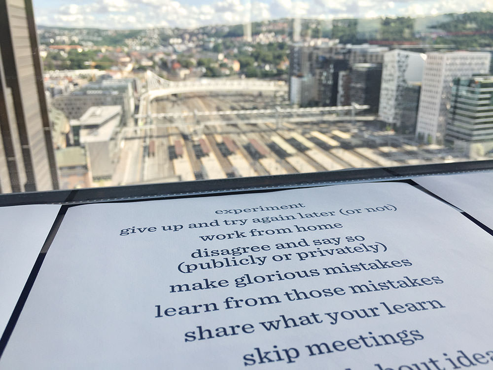

We really like an idea that the team at Government Digital Service (GDS) wrote about last year in a blogpost: [It's ok to say what's ok](https://gds.blog.gov.uk/2016/05/25/its-ok-to-say-whats-ok/). 🙌

> Maybe we just need to say what’s ok. To be explicit about the things that those of us who have been here a few years take for granted. So our team wrote a list of things it's ok to do at GDS.

Inspired by this most excellent idea and their list — we wrote our own.

## It’s okay to…

* say “I don’t understand”
* never have heard about something
* ask questions all the time
* question everything
* ask for advice and feedback
* depend on your team
* not ask permission
* wear shorts to the office
* or a hoodie, skirt, shirt or sari
* put people before code
* eat all the bananas when the fruit arrives
* have no idea what you’re doing and try anyway
* get lost down rabbit holes
* use work hours to read and learn
* experiment
* give up and try again later (or not)
* work from home
* disagree and say so (publicly or privately)
* make glorious mistakes
* learn from those mistakes
* share what your learn
* skip meetings
* talk out loud about ideas and problems
* ask people to lower their voices
* or to move the discussion out from the landscape
* need a break
* be upset and ask for support
* care more about co-workers than corporations
* challenge code, ideas and culture
* change your mind
* think out loud
* not read everything on slack
* have your lunch break in the canteen
* start lunch train slackbots
* never take the stairs <a href="#fn1" id="ref1" role="doc-noteref">1</a>
* prefer to enjoy lunch in solitude
* share your ideas (out loud! or in writing!)
* say no if you are busy
* log off slack and email
* put headphones on to focus
* hide away in a quiet room
* not work at all when you are sick
* wait till next week
* deploy tomorrow instead
* bring sweets or cake to the office

<ol class="footnotes" role="doc-endnotes">
  <li id="fn1" role="doc-endnote">
    Except if there is a fire alarm, then please absolutely use the stairs. 
    <a class="footnote-jump btn-link di" href="#ref1" title="Jump back to footnote 1 in the text">&#8617;</a>
  </li>
</ol>
