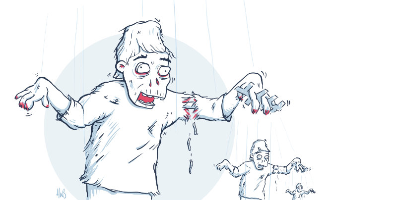

_“This is bug, please say hello.”_

There are many ways to introduce bugs. Adding CSS as dependencies is one of them. 

## True story
Let’s say you add a small and simple css reset dependency to your project. A somewhat opinionated and best practice-based stylesheet that has thousands of weekly downloads. It serves as your baseline for every new project and it’s easy to keep up to date.

Another developer does the same, except there’s this one property that she wants to change. She makes a new issue in the git repo. Following a small back and forth with the project owner and another developer, everyone agrees. Without being significantly challenged, the new property is added in the next release.

You and thousands of others upgrade your dependencies. Most are not noticeably affected, but many, including yourself, start to notice that text wrap unexpectedly, elements scale differently or maybe the padding looks off.

Via the changelog, you find the corresponding issue thread. It’s too late, the _discussion_ is closed and you know it’s usually harder to remove something once it’s added. So you start resetting the reset, overriding the override, to get every element back to default browser behaviour. Writing more code to counter something that was intended for the opposite.

This is a true story, modified to provide learning instead of finger-pointing.

## Cascading bugs
The person initiating the change was someone three times removed from your project – a stranger for whom it’s impossible to see the extent of the code in other projects – and perhaps didn't even consider it.

In a search for ready-made best practice-based CSS, adding it as dependency is essentially handing over control to an outsider. Not only for the code you didn’t write, it also impacts what you _did_ write. While all dependencies can contain bugs, the C in CSS means that the bugs are also cascading. Breaking changes can crawl entire projects. 

The most direct type of cascading is inheritance, it can be a text property that is set on the html element and gets inherited by everything inside it. The higher up you specify a style, the more potential it holds. The other kind can be a background colour, it isn’t inherited, but because of transparency, it’s visible until another element in front of it gets its own background colour.

This makes an external CSS dependency into a potential Pandora’s box. One update and your page can be swarming with bugs. They don’t stop until you explicitly override or counter the styles. In turn, creating another level of complexity, increasing the chances of more bugs when the dependency gets updated again and your overrides suddenly don’t match, being too much, too little or ineffective. 

## Best practice-blindness
Best practices are not a set of reference values or solutions – like a template for any interface. Instead, there is a big chance that among all the best practices there will be many that don’t fit your project.

There is no getting around dependencies – but a level of control should always be a goal. CSS, being finished code most of the time, is easy to copy – even just the relevant parts. No matter how best practice a stylesheet is, adding it as a dependency is not. It will in large not be able to radically improve your code when upgraded. There is only a much bigger chance of introducing breaking changes.

Regain control by keeping the good parts. If you are able to evaluate a stylesheet and write countering CSS, you are probably able to write or just plain copy the code which makes it so that you don’t have to counter it in the first place.

If you are still in doubt, ask yourself: If the code is so good that I don’t need the ability to edit it, why should I keep it updateable and by that give an outsider the ability to edit it instead and potentially impact all my other CSS?

## Zombie CSS
Zombies have a very narrow focus, they only work on their own project and have no concept of others’. Problematising an oncoming semi-truck is just not happening.

Zombie CSS is not a cool new framework that makes it easy to write and maintain CSS. It's code that is shared repeatedly without sufficient documentation, added as dependencies without much consideration and changed without being challenged.

While people must do what they consider best for their project, and it's largely the end developer's responsibility what gets added, popular code comes with some level of responsibility too. There’s no way to know for sure how it will affect other people’s projects, but there should be some level of healthy problematising along the way. Just because something fits all your projects, doesn’t mean it will work as a default. 

Please share, it is what brings the web forward. But when you do, please share why and how as well, so people can make decisions with open eyes. The freedom and ability to make such decisions is what led you to your results in the first place. 

Great code should come with great documentation.
