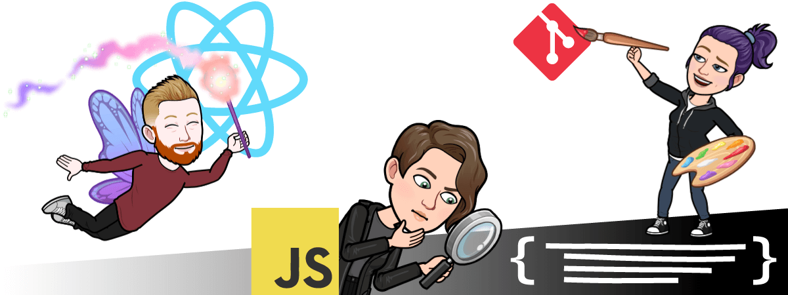
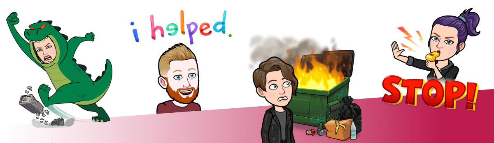
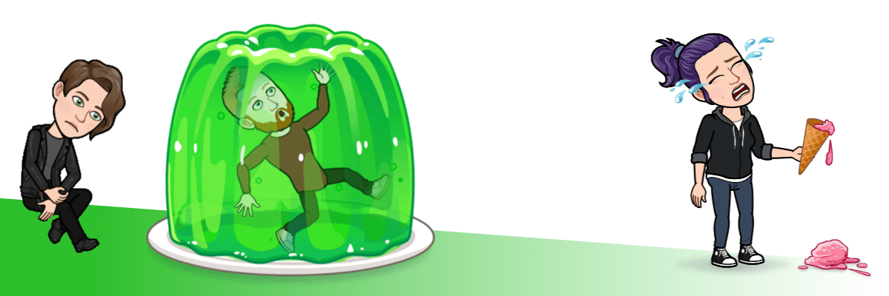
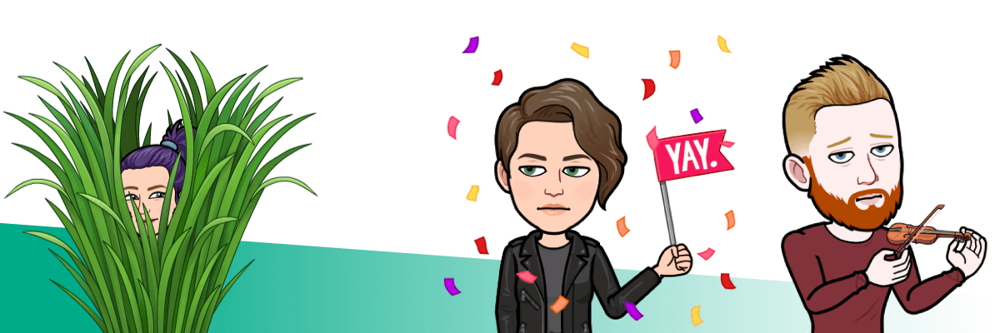

You might have heard all about frontend devs and UX-designers, but have you heard about those that are practically both? The ones who are into both interactions and code? No, not mutants, but hybrids! Like the ones on the frontend team who think that designing and developing an interface are two sides of the same coin.

Operating in what has been considered two separated fields means there is a lot to learn, maybe not more than anyone else, but across disciplines. There is seemingly always something new. And what we learn we try to bring on and exchange for new knowledge.

Sometimes you want to tear down and rebuild an interface, only to find that there’s a lot more to an application than what you currently see. Sometimes new knowledge leads to old code breaking.

Development in any form is bound to make you frustrated from time to time. 

As a hybrid you might be working on a brand new service interface, only to find yourself the next day digging through old code or banging your head against the wall trying to understand why your tests are failing. No walls are actually harmed, it's just a metaphor for trying, failing and reading.

It’s easier to bang your head against the wall together with other developers. Breakthroughs usually happen in the end. That’s really why we are a team, and why we like working with other teams.

When the bugs are fixed and the thumbs up are given. You feel a sense of success as your hybrid skills have made the workflow smoother and the service better.

Well … at least until someone finds a lurking bug, disagrees with you or just want to push you further. Roll up your sleeves, it’s time for new iterations.

If this imagery piques your interest, perhaps you are a hybrid too? Come to think of it, aren’t we all, really? Can one develop something with an interface without shaping it?
